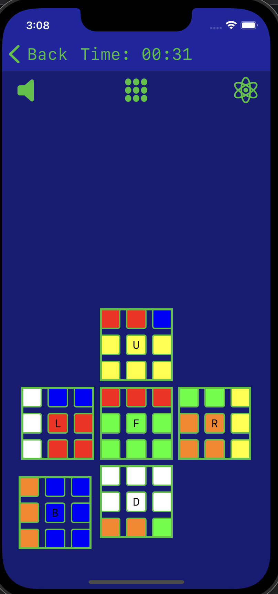

- 👋 Hi, I’m @iGFarr; Check out one of my oldest and favorite iOS projects, <a href="https://github.com/iGFarr/CubeBuddyV2">CubeBuddyV2</a>. *Now adapted for all major languages!

  
   

<!---
iGFarr/iGFarr is a ✨ special ✨ repository because its `README.md` (this file) appears on your GitHub profile.
You can click the Preview link to take a look at your changes.
--->
